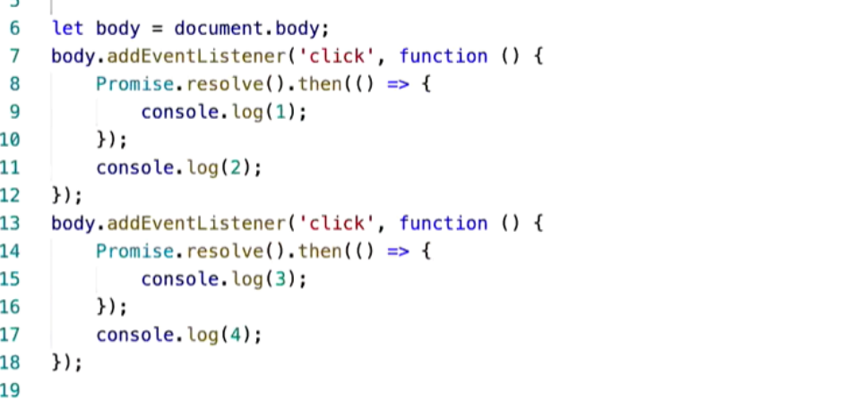
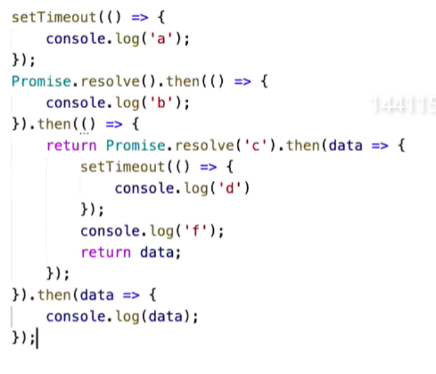

## 任务列队

宏仁务：` ` ` script、setTimeout、setInterval、I/O、setImmediate(node环境) ` ` `

微任务：` ` ` promise、mutationObserver、process.nextTick() ` ` `

1、主线程：一开始从上往下；遇到其他宏仁务，放置到宏仁务列队中，遇到微任务，放置到微任务列队中

2、然后等主线程宏仁务做完，就检查是否有微任务，然后就做完微任务，

3、微任务做完后，再看看有没有宏仁务，有的话就继续做宏仁务。

---

## DOM事件是一个过程

**行为触发**：（异步）什么时候用户点击、返回响应，这都是未知的也就是异步的。（宏仁务）

**事件处理**：（同步）系统接收到事件触发，找到对应dom的回调函数、并执行的过程是同步的。

``` js
console.log('本轮任务');
new Promise((resolve, reject) => {
    resolve(3)
}).then(() => {
    console.log('本轮微任务');
})
document.getElementById('div').addEventListener('click', () => {
    console.log('click');
})
document.getElementById('div').click()
```

> 答案：本轮任务、click、本轮微任务

> 解析：对于addEventListener来说，本身是个异步任务，所以在```document.getElementById('div').click()```之前，放入了宏仁务列队，而当我们` ` `click()` ` `触发时，会立即执行，是一个同步的过程，所以即可以想成是一个同步的过程，所以` ` `console.log(click)` ` `会比微任务的` ` `console.log("本轮微任务")` ``早执行。

---

</img>

>答案：2143

>解析：`addEventListener`是一个宏仁务，两个`addEventListener`依次放进去宏仁务列队，当我们点击按钮的时候，依次触发这两个宏仁务：对于第一个宏仁务中，Promise.then()是一个微任务，在`console.log(2)`后,所以输出2，1；同理，后面输出4，3，由于微任务比宏仁务早执行，所以2，1，在4，3，前面。

---

</img>

>答案：bfcad

>解析：promise的链式then只有当前一个执行完，再继续往下返回一个promsie对象（没有返回默认promise空对象）然后才能继续执行。
所以对于`console.log(b)`后，执行下一个then，return了一个Promise对象，只有这个对象的then执行完后，再执行到下一个then。所以对于`Promise.resovle('c')`的then中，settimeout放在宏仁务，打印f后，返回了data，data即为c，然后继续下一个then。这个then的data即为c，所以打印c。然后微任务列队为空后，执行两个宏仁务settimeout。