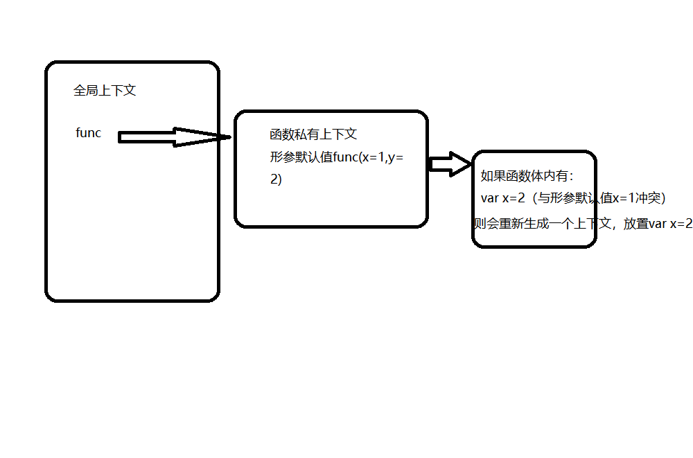

```js
var x=1;
function func(x,y=function(){x=2}){
    x=3;
    y();
    console.log(x);//2;
}
func(5);
console.log(x);//1
```
```js
var x=1;
function func(x,y=function(){x=2}){
    var x=3;
    y();
    console.log(x);//3
}
func(5);
console.log(x);//1
```

## 函数形参默认值规定

函数形参  |函数体中有let、const、var声明的变量|无var、let、const声明的变量
-|-|-
有默认值|let/const报错（重复声明）、如果有var声明，则除了形成的这个私有上下文，还会把函数体中的声明单独列为一个独立的私有的私有上下文。|只有形成的这个私有上下文
无默认值|-|-

</img>