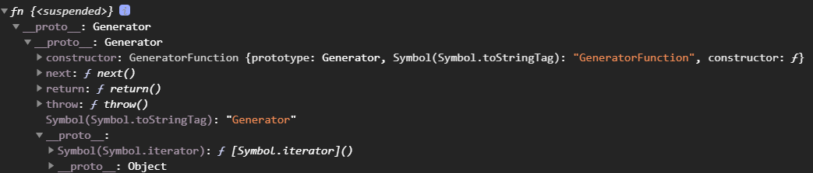

*美团面试题*：数组/对象遍历方式的深入研究（含内置方法重写以及iterator）

* 常规遍历方式：
    - for 循环
    - for in 循环
    - while 循环
    - for of 循环

* 函数式编程
    - forEach
    - map
    - reduce
    - Objects.keys

* for of 循环只能遍历具备iterator规范的。（即如果有Symbol.iterator标志）
    - 数组
    - 部分类数组：arguments/NodeList/HTMLCollection
    - Set/Map
    - String
* **注意：**普通对象不具备iterator规范的标志Symbol.iterator

``` js
// 这里用生成器函数得出结果返回一个Symbol.iterator
function *fn(){
    yield 1;
    yield 2;
}
let itor=fn();//生成器函数返回的结果是一个迭代器；拥有next方法，执行next方法可以一次遍历数据结构中的每一项的值 ->数据结构具备Symbol.iterator属性，说明其是可以被迭代的。

console.log(itor.next())//->{value:1,done:false}
console.log(itor.next())//->{value:2,done:false}
console.log(itor.next())//->{value:undefined,done:true}
```
</img>

```js
function *fn(){
    let x=yield 1;
    console.log(x);//->10 不是yield的返回值，是执行next方法传递进来的值。
    yield 2;
}
let itor=fn();
console.log(itor.next())//->{value:1,done:false},这一步从头开始，到第一个yield结束。
console.log(itor.next(10))//->{value:2,done:false}，这一步解决第一个yield，即yield 1那里，其实是把1换成了10，然后赋值给x遇到yield 2停止。
console.log(itor.next())//->{value:undefined,done:true}执行yield 2.然后结束。
```

## 普通对象迭代方法：
```js
let obj = {
    0: 10,
    1: 20,
    2: 30,
    3: 40,
    length: 4,
    //第一种方法，调用其他已有迭代器的标志
    // [Symbol.iterator]: Array.prototype[Symbol.iterator]
    //第二种方法：手写一个
    [Symbol.iterator]: function () {
        let self = this,
            index = 0;
        return {
            next() {
                if (index > self.length - 1) {
                    return {
                        value: undefined,
                        done: true
                    };
                }
                return {
                    value: self[index++],
                    done: false
                };
            }
        };
    }
};
for (let item of obj) {
    console.log(item);
}
```