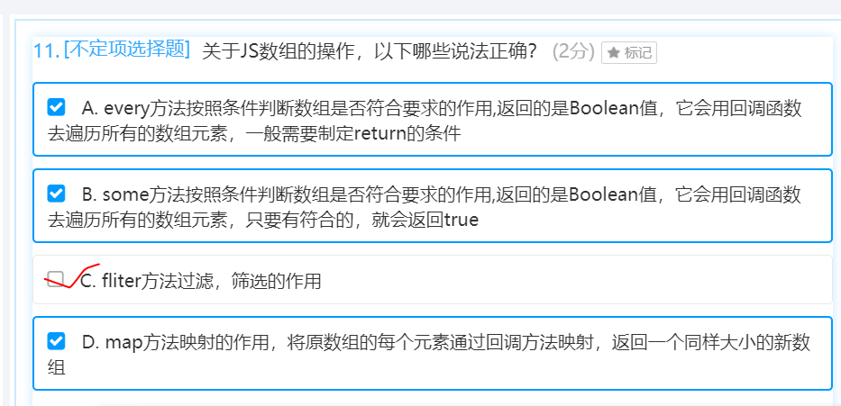

</img>  
[跨域方法](https://www.cnblogs.com/happy-8090/p/11570998.html)  
[跨域通信](https://www.jb51.net/article/77312.htm)

---
</img>
- render tree只包含了用于渲染页面的节点  
[浏览器构建与渲染的过程](https://www.cnblogs.com/wangge001/p/9029162.html)

---

</img>

---

</img>
- oninput onpropertychange事件的比较
汇总 onchange onpropertychange 和 oninput 事件的区别


- onchange 事件与 onpropertychange 事件的区别：
 onchange 事件在内容改变（两次内容有可能还是相等的）且失去焦点时触发。
 onpropertychange 事件却是实时触发，即每增加或删除一个字符就会触发，通过 js 改变也会触发该事件，但是该事件 IE 专有。
- oninput 事件与 onpropertychange 事件的区别：
 oninput 事件是 IE 之外的大多数浏览器支持的事件，在 value 改变时触发，实时的，即每增加或删除一个字符就会触发，然而通过 js 改变 value 时，却不会触发。  
 onpropertychange 事件是任何属性改变都会触发的，而 oninput 却只在 value 改变时触发，oninput 要通过 addEventListener() 来注册，onpropertychange 注册方式跟一般事件一样。（此处都是指在js中动态绑定事件，以实现内容与行为分离）
- oninput 与 onpropertychange 失效的情况：  
 （1）oninput 事件：a). 当脚本中改变 value 时，不会触发；b).从浏览器的自动下拉提示中选取时，不会触发。  
 （2）onpropertychange 事件：当 input 设置为 disable=true后，onpropertychange 不会触发。 

---

</img>
 
---

```js
//实现[1,2,3,4,5].duplicator()//[1,2,3,4,5,1,2,3,4,5]

Array.prototype.duplicator = function() {
    let len = this.length;
    for (var i = 0; i < len; i++) {
        this.push(this[i]);
    }
};
var a = [1, 2, 3, 4, 5]
a.duplicator();
console.log(a)

```

--- 
```js
var a = 10,
    b = 20,
    c = 30;
++a;
a++; //12
e = ++a + (++b) + (c++) + a++;
//++12+21+31+12++;然后a++运算符比+先，所以是：++12+21+31+13;即++77
//又由于++77比=晚，所以e是77
console.log(e)
```

--- 

- CSS中哪些属性可以继承？  
1、字体系列属性 font-family：字体系列 font-weight：字体的粗 font-size：字体的大小 font-style：字体的风格  
2、文本系列属性 text-indent：文本缩进 text-align：文本水平对齐 line-height：行高 word-spacing：单词之间的间距 letter-spacing：中文或者字母之间的间距 text-transform：控制文本大小写（就是uppercase、lowercase、capitalize这三个） color：文本颜色  
3、元素可见性：visibility：控制元素显示隐藏  
4、列表布局属性：list-style：列表风格，包括list-style-type、list-style-image等  
5、光标属性：cursor：光标显示为何种形态  
---

- splice(index,howmany,item1……item6);  
参数：index从何处开始，howmany多少个（0不删除）,item1-6要添加到数组的元素。  
返回值：被删除的元素数组。

```js
var arr = [1, 2];
var arr2 = arr.concat();
arr2.push(arr.splice(1, 0));
console.log(arr2);
```

---

```js
var a = b = 10;
(function() {
    var a = b = 20;
})();
console.log(b);//20
//1、var a=10;var b=10;
//2、自执行函数中a是函数内的变量，b是this.b也就是全局的b，所以b是20；
```
---

```js
(function f() {
    function f() {
        console.log(1);
        return 1;
    }
    return f();

    function f() {
        console.log(2);
        return 2;
    }
})();
//答案是2；因为最外层的f在调用的时候，里面的f在声明的时候后面的2覆盖了1，所以return f()的时候是调用下面的那个。
```
---
</img>
- try catch里面定义function,执行function在try catch里面，可以捕捉到。
- try catch里面定义function,执行function在try catch外面，捕捉不到。
- try catch无法捕捉setTimeout的错误。

- while死循环会阻塞同步任务列队，然后异步列队的setTimeout无法进去同步列队，因此不能执行。

---
</img>

---
</img>
</img>

---
```js
var foo = {
    bar: function() { return this.baz; },
    baz: 1
}
console.log(typeof(foo.bar)())
console.log(typeof(f = foo.bar)())
console.log(f())
//将foo.bar方法赋值给f，并在全局下执行，由于全局没有baz，所以是undefined
```

---
</img>
---

</img>
---

- JS写出从浏览器的URL中获取查询字符串参数的方法。
```js
function getQueryVariable(variable) {
    //    var query = window.location.search.substring(1);
    var query = '?courseid = 8&cahpterid = 86'.substring(1);
    var vars = query.split("&");
    for (var i = 0; i < vars.length; i++) {
        var pair = vars[i].split("=").map(item => item.trim());
        //去除首位空格
        if (pair[0] == variable) { return pair[1]; }
    }
    return (false);
}
console.log(getQueryVariable('courseid'))
```
--- 
</img>
--- 


--- 