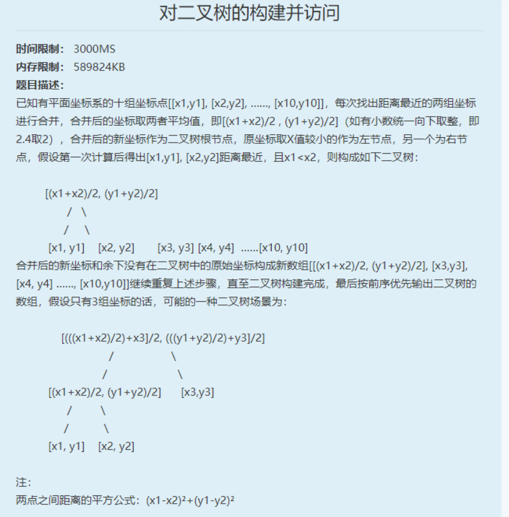

</img>

```js
// function TreeNode(val) {
//     this.val = val;
//     this.left = this.right = null;
// }
let arr = '[[5,10], [3,15], [10,18]]'.split(", ");
arr[0] = arr[0].replace('[', '');
arr[arr.length - 1] = arr[arr.length - 1].replace(']', '');
for (let i = 0; i < arr.length; i++) {
    arr[i] = arr[i].replace('[', '');
    arr[i] = arr[i].replace(']', '');
    arr[i] = arr[i].split(',');
}console.log(arr);

```
</img>

```js

for (let i = 0; i < len; i++) {
    if (!(typeof arr[i] == 'number' && arr[i] >= 0)) {
        arr.splice(i, 1)
    }
}

//普通sort后从大到小
//[1,0,2,3,11]=>[0,1,11,2,3]=>321110;
```

</img>
```js
let demo = 'ABAC';
let ans = '11111111jin sheng jin shi';

function a() {
    var patt = /^[A-Za-z ]+$/;
    if (!patt.test(ans)) {
        console.log(-1);
        return;
    }
    let arr = ans.split(' ');
    let map = new Map();
    for (let i = 0; i < demo.length; i++) {
        if (map.has(demo[i])) {
            let arr = map.get(demo[i]);
            arr.push(i);
        } else {
            map.set(demo[i], [i]);
        }
    }
    let flag = true;
    map.forEach((value, key) => {
        let arr2 = value;
        let temp = arr[arr2[0]]
        for (let i = 1; i < arr2.length; i++) {
            if (temp != arr[arr2[i]]) {
                console.log(0);
                flag = false;
                return;
            }
        }
    })
    if (flag) console.log(1);
}
a();
```