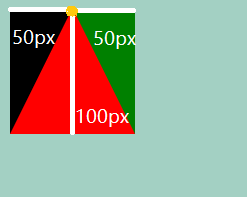
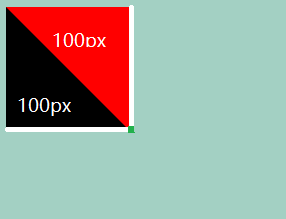
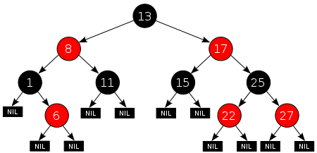

## css 画三角形

1. width、height为0
2. `border-xxx：50px solid transparent;`属性是距离content的距离为50，最后的是颜色。

</img>
</img>

```css
//三角形
.trangle {
  width: 0;
  height: 0;
  border-left: 50px solid transparent;
  border-right: 50px solid transparent;
  border-bottom: 100px solid red;
}

//等腰直角三角形
.tangle2{
    width:0;
    height:0;
    border-top:100px solid red;
    border-left:100px solid transparent;
}

```

## CSS画梯形

`border-width:上右下左`
```css
.tix{
    width:100px;
    height:0;
    border-top: 120px solid red;
    border-right:40px solid transparent;
}
```

## css 画斑马线
`linear-gradient`:线性变化：颜色->颜色 or 下面的情况
```css
.test3{	
		width: 520px;
		height: 80px;
		margin: 20px auto;
		background: linear-gradient(to right, #000 50%, #fff 50%);
		background-size: 30px 100%;
}
```


## 二叉树查找节点

前中后序：
val、left、right；
left、val、right；
left、right、val。

## 红黑树
　　1、介绍：红黑树是一种二叉查找树，但在每个节点上增加一个存储位表示节点的颜色，可以是red或black。通过对任何一条从根到叶子的路径上的各个节点着色方式的限制，红黑树确保没有一条路径会比其他路径长出两倍，因而是接近平衡的。

　　2、定义：它或者是一颗空树，或者是具有一下性质的二叉查找树

　　　　1）：每个节点或是红的，或是黑的。

　　　　2）：根节点是黑的。

　　　　3）：每个叶节点（NIL）是黑的。（所有NULL结点称为叶子节点，且认为颜色为黑）

　　　　4）：如果一个节点是红的，则他的两个子节点是黑的。

　　　　5）：对每个节点，从该节点到其子孙节点的所有路径上包含相同数目的黑节点。

</img>

3、结构：树中的每个节点上包含五个域：color、key、left、right、p。如果其节点没有一个子节点或者父节点，则该节点相应的指针（p）域包含值NIL。我们把这些NIL视为指向二叉查找树的外节点，而把带关键字的节点是为树的内节点。

　　4、高度：一颗有n个内节点的红黑树的高至多为2lg(n+1)。

　　5、应用：Java集合中的TreeSet和TreeMap，C++ STL中的set、map，以及Linux虚拟内存的管理，都是通过红黑树去实现的。

## hashMap
数组：采用一段连续的存储单元来存储数据。对于指定下标的查找，时间复杂度为O(1)；通过给定值进行查找，需要遍历数组，逐一比对给定关键字和数组元素，时间复杂度为O(n)，当然，对于有序数组，则可采用二分查找，插值查找，斐波那契查找等方式，可将查找复杂度提高为O(logn)；对于一般的插入删除操作，涉及到数组元素的移动，其平均复杂度也为O(n)

线性链表：对于链表的新增，删除等操作（在找到指定操作位置后），仅需处理结点间的引用即可，时间复杂度为O(1)，而查找操作需要遍历链表逐一进行比对，复杂度为O(n)

二叉树：对一棵相对平衡的有序二叉树，对其进行插入，查找，删除等操作，平均复杂度均为O(logn)。

哈希表：相比上述几种数据结构，在哈希表中进行添加，删除，查找等操作，性能十分之高，不考虑哈希冲突的情况下（后面会探讨下哈希冲突的情况），仅需一次定位即可完成，时间复杂度为O(1)，接下来我们就来看看哈希表是如何实现达到惊艳的常数阶O(1)的。

我们知道，数据结构的物理存储结构只有两种：顺序存储结构和链式存储结构（像栈，队列，树，图等是从逻辑结构去抽象的，映射到内存中，也这两种物理组织形式），而在上面我们提到过，在数组中根据下标查找某个元素，一次定位就可以达到，哈希表利用了这种特性，哈希表的主干就是数组。

## vue封装过什么组件么

vue.extends();
写一个component，然后exports出来，然后就在需要的界面import进来，然后就在vue的实例下的components写上，然后就可以实现了。

原理：vue.extends()是获取当前组件的父类的构造函数. 用vue.extends()生成当前组件的构造函数，然后再根据生命周期进行mount挂载处理。


## vue传值

父子传值，
兄弟传值，
eventbus传值。


## webpack原理：

webpack根据配置找到入口，js文件，根据代码中的import ，require，解析推断出来这个文件所依赖的资源文件（css，img等），然后就解析对应的资源模块，生成对应的依赖关系树，递归这个依赖关系树，然后根据规则配置，交给对应的loader or plugins进行加载，然后最后放进去bundle.js，从而实现资源的打包。

功能：代码转换，文件优化，代码分割，模块合并，自动刷新，代码校验，自动发布。

webpack打包之后的文件：

 1、自执行函数
 2、参数通过对象的形式传递的
 - key：文件路径
 - value:是一个函数（执行当前文件的代码）
 - eval执行字符串代码
 - 多个相互依赖的文件最终打包成一个文件
 3、require方法，生成一个__webpack_require__方法通过递归调用自己，然后把自己相关的文件执行。


webpack的好处：
  打包：
    体积更小
    速度更快

  大纲：
    小白：webpack 所有的文件-->js文件
          优化：
               小白：使用懒加载，热更新，不用的不引入，大的包放到cdn上
               大牛：
                 自带的优化：
                   tree-sharking:依赖关系的解析-->不用的代码不打包
                     生产环境才有效
                   scope-hositing:作用域提升
                     变量-->结果 不会打包到代码中（`let a =10,b=20,c=30; console.log(a+b+c);`,此时不会把a，b，c打包到代码中，因为abc只用于计算）
                 自己做的优化：
                   速度：
                   
                   happypack：多线程打包
                   注意：体积比较小，打包的时候比较慢
                   
                   moment：时间插件 引入的时候会引入了很多不需要的语言包;
                   IgnorePlugin 就会把不需要的语言包删掉

                   html cdn地址
                   打包的时候可以忽略不打包的文件
                   
                   ```js
                   //不打包
                   externals：{
                     'jquery':"$"
                   }
                   ```
                  

