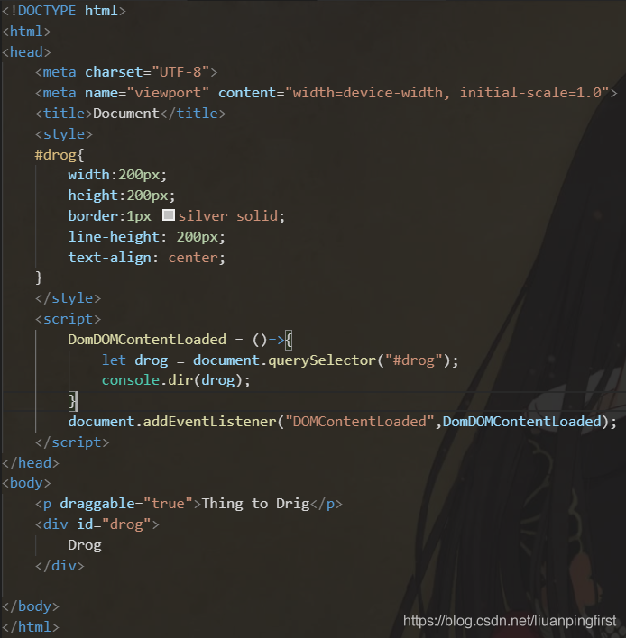

1. 页面文档完全加载并解析完毕之后会触发的事件是： DOMContentLoaded

DOMContentLoaded和window.onload的触发时机不同在哪？

DOMContentLoaded：当dom解析完成后就会触发，这是跟上面阻塞dom解析的资源请求息息相关的，当这些阻塞dom解析的资源全部加载完，就会触发DOMContentLoad

window.onload:当阻塞资源与非阻塞资源全部加载完才会触发。

这也就意味着window.onload的触发时机是比DOMContentLoad更晚的，想尽早操作dom就可以使用DOMContentLoaded

如何使用DOMContentLoaded

</img>

2. 样式文件的加载会阻塞脚本的执行。

（css文件不会阻塞DOM树的构建，但是会阻塞我们的render渲染的过程，只有当css加载完毕之后，才会来构成渲染树，**css加载不会阻塞DOM树解析，但是会阻塞DOM树渲染。**）

（**css加载会阻塞后面的js语句的执行**）


3. iframe会阻塞主页的onload事件。 


4. img中的资源下载不会阻塞页面解析,同理会阻塞页面渲染。

5. media queries的条件：设备宽度，高度，类型，像素比

6. 'string' instanceof String 错误

7. 箭头函数和普通函数有什么区别？

> 箭头函数特点：  
（1）函数体内的this对象，就是定义时所在的对象，而不是使用时所在的对象。  
（2）不可以当作构造函数，也就是说，不可以使用new命令，否则会抛出一个错误。  
（3）不可以使用arguments对象，该对象在函数体内不存在。如果要用，可以用Rest参数代替。  
（4）不可以使用yield命令，因此箭头函数不能用作Generator函数。  

8. js的5个常用的字符串操作函数

> slice()、splice()、indexOf()、search()、concat()、repeat()、substring()

9. js检测一个变量是String类型，用函数实现。
```js
function a(s){
    //or s.constructor===String
    return typeof s == 'string';
}
a("sds");

```

10. 至少4种vue当中的指令和它的用法

>v-if与v-for:  
v-if是根据条件来渲染元素。切换时会将改组件销毁或重建。  
v-for是遍历对象、数组等的。使用是使用key以便能够跟踪每个节点的身份，优化diff算法。  
不推荐v-if和v-for一起使用。因为当他们处于同一节点时，v-for的优先级比v-if更高。
与vue3不同：vue3的v-if比v-for优先级高。

>v-show：会被编译成指令，条件不足时控制样式将对应节点隐藏。内部其他指令依旧会继续执行。
与v-if不同，v-if会造成重排，而v-show不会。

>v-once：只渲染元素和组件一次。随后的重新渲染，元素/组件及其所有的子节点将被视为静态内容并跳过。这可以用于优化更新性能。

>v-bind：缩写（:）  
动态的绑定一个或者多个属性或者参数

>v-on：绑定原生DOM事件或自定义事件或者调用修饰符（.stop、.prevent等）

>v-model：双向绑定。也就是v-bind和v-on的语法糖：v-bind绑定一个属性 v-on绑定一个input事件。

11. css隐藏元素的几种方法，并说出他们的区别。

>1. display:none;  
2. visibility:hidden
3. opacity:0
4. 设置height、width为0
5. 设置position与left、top、bottom、right、将元素移出屏幕外。
6. 设置position和z-index，将z-index设置成尽量小的负数。
区别：display：none会重排和重绘，而visibility只会引起重绘。也就是说display会释放该内存，而visibility还保留着相应的空间。
opacity与visibility同理。


