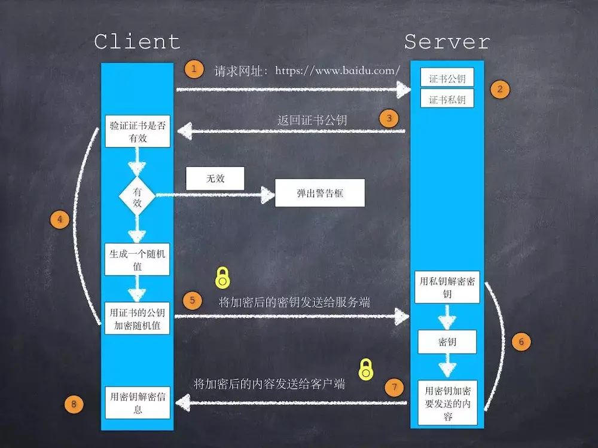

## 事件处理机制

三阶段:捕获、目标、冒泡

可以通过事件目标对象的 eventPhase 属性来得知当前事件在什么阶段。（1 捕获，2 目标，3 处理）

addEventListener 注册事件，其中参数有 useCapture：true 时该事件在捕获阶段触发，false 在冒泡阶段触发。默认是冒泡。

e.stopPropation:阻止事件向下捕获或者向上冒泡。

为什么要阻止事件传递：因为防止点透现象（父与子都有 click，都被触发，但我们只想触发子的）

e.preventDefault：阻止默认事件，不会阻止事件传递。

事件代理：事件委托：

多个子元素的同一事件可以绑定在父元素上。提高效率，减少代码量。

- 父元素通过`e.target`或者`e.srcElement`（IE）识别子元素。然后再判断子元素是不是相应的标签`nodeName`

## https 握手过程

</img>

- 用户在浏览器输入一个 https 网址，连接到服务器的 443 端口。
- 服务器返回给浏览器证书（证书里面包含公钥）
- 浏览器首先会验证公钥是否有效，比如颁发机构，过期时间等等，如果发现异常，则会弹出一个警示框，提示证书存在的问题。如果证书没有问题，那么就生成一个随机值。然后用公钥对这个随机值进行非对称加密。（这个随机值就是以后进行对称加密的公钥）
- 服务器拿私钥解密出对称加密的公钥。然后以后就用这个公钥进行对称加密。
- 浏览器就可以用这个公钥进行解密和加密了。

## 为什么是 ssl 证书是安全的，ssl 解密过程

CA 机构对于服务器的公钥的加密是非对称加密的过程。

CA 机构公开在网络上公钥，以便浏览器用公钥进行解析获得我们的证书信息

证书是否过期，发行服务器证书的 CA 是否可靠，发行者证书的公钥能否正确解开服务器证书的“发行者的数字签名”，服务器证书上的域名是否和服务器的实际域名相匹配。

浏览器拿到证书之后，用公钥进行解析我们的证书信息并验证。。

为什么安全，是因为如果中间人不知道 CA 机构的私钥，所以无法篡改我们的证书里面的内容后再进行加密。加密后的东西就不能用公开在网络上的公钥进行解密了。

## 前端跨域

同源策略：协议+域名+端口都要相同，不同的域名指向同一个 ip 地址，也是非同源的。

跨域资源共享（CORS）：服务端设置 Access-Control-Allow-Origin 即可，前端无须设置，若要带 cookie 请求：前后端都需要设置（withCredentials: true）

vue 的`proxy`代理跨域 or react 的`http-proxy-middleware`：设置 proxy 代理接口。`webpack.config.js` `vue.config.js` `setupProxy.js`

websocket：`ws`或者`wss`连接标志.websocket不会受同源策略的约束。

nginx 的反向代理接口：`nginx.config`

`jsonp`、`document.domain+iframe`、`window.name+iframe`、`postMessage`(主要是对于两个不同域名的一些数据的传递，`postMessage(数据,地址)`)

## 前端安全

### xss：跨站脚本攻击，反射型与存储型和 DOM 类型

反射型：xss 代码出现在 url 中，作为输入提交到服务器端，服务器解析后相应内容和脚本一起传回浏览器，然后浏览器解析执行 xss 代码。如：`http://www.foo.com/xss/reflect.php?x=<script>alert(1)</script>`

存储型：提交的代码会存储在服务器端（数据库，内存，文件系统等）

留言板 XSS，用户提交一条包含 XSS 代码的留言存储到数据库，目标用户查看留言板时，那些留言的内容会从数据库查询出来并显示，浏览器发现有 XSS 代码，就当做正常的 HTML 与 Js 解析执行，于是触发了 XSS 攻击。

DOMxss：触发 XSS 靠的是浏览器端的 DOM 解析，完全是客户端的事情。`http://www.a.com/xss/domxss.html#alert(1)`

1. 使用 document.write 直接输出数据。
2. 使用 innerHTML 直接输出数据。
3. 使用 location、location.href、location.replace、iframe.src、document.referer、window.name 等这些。

### 防御：

- cookie 安全策略：服务器设置 cookie：

`http-only`(只允许 http 或 https 获取 cookie，js 无法读取 cookie)

`secure-only`(只允许 https 读取，cookie)

`host-only`(只允许主机域名与 domain 设置完全一致时才能访问 cookie)

- x-xss-protection 设置

在响应头设置 x-xss-protection：0 禁用 xss 保护，1 启用 xss 保护。

- html 编码：

将`&,<,>,',",/`转义为实体字符，后面再反转义回来。

- html 属性进行编码：`<input name="alert(xss)" />`

- jacascript 编码：

- url 编码：对参数进行 encodeURIComponent 编码

- 网页安全政策<meta http-equiv="Content-Security-Policy" content="">

### csrf：跨站请求伪造：攻击者盗用身份，以你的名义发送恶意请求。

### 防御

验证 HTTP Referer 字段：记录了 http 请求的来源地址

token 验证

samesite（同站）：管制哪些跨站申请能够携带 cookie；

`SameSite=Strict/Lax/None`:严格模式（同站申请才能发送 cookie），lax 宽松模式（平安的跨站申请才能发送 cookie），none

平安的跨站申请：指的是 lax 模式下浏览器把哪些跨站申请看作平安的申请：同步的 GET 申请，form 的 get 形式提交，window.open()等等。

## 小程序原理：

### 小程序与普通网页的区别：

普通网页：需要 html，css 交互需要 js 等。浏览器渲染时单线程，dom 和 js 解析互斥。
小程序：渲染需要 webview 配合，ui 和 js 解析分别在两个线程执行。

html 和 css 工作在渲染层，js 脚本运行在逻辑层。

渲染层通过{}绑定变量数据，逻辑层处理出局，setState 方法将数据传到渲染层。

初始数据传递和更新数据（setState）会消耗时间，所以可以将多次的 setSate 合并成一次。

小程序是基于双线程模型，任何数据传递都是线程之间的通信，因此都会有一定的延时，这不像传统 Web 那样，当界面需要更新时，通过调用更新接口 UI 就会同步地渲染出来。在小程序架构里，这一切都会变成异步。

页面栈只有 10 级。

## 时分针夹角

分针每分钟转 360/60=6 度；

分针每秒钟转 6/60=0.1 度；

时针每小时转 360/12=30 度；

时针每分钟 30/60=0.5 度；

时针每秒钟转 0.5/60=1/120 度；

所以 h 时 m 分 s 秒时针与 0 刻度线（12 时的刻度线）的夹角:30h+0.5m+1/120\*s;

h 时 m 分 s 秒分针与 0 刻度线的夹角：6m+0.1s;

时针与分针夹角 a:

a=|6m+0.1-30h-0.5m-1/120s|;

习惯上，超过 180 度的角一般用小于 180 度的角表示

注意 h%12;if(m>60){ h=(h+1)%12;m=m%60;}

## url 匹配

## 大数相加（字符串相加）

## 写代码用原生 JS 实现一个类似百度搜索框的自动完成控件（已实现，并附加防抖）

## 请写一个函数，计算一篇英文文章中出现次数最多的单词及出现次数

```js
function counts(article) {
  article = article.trim().toUpperCase();
  var array = article.match(/[A-z]+/g);
  article = " " + array.join("  ") + " ";
  var max = 0,
    word,
    num = 0,
    maxword = "";
  for (var i = 0; i < array.length; i++) {
    word = new RegExp(" " + array[i] + " ", "g");
    num = article.match(word).length;
    if (num > max) {
      max = num;
      maxword = array[i];
    }
  }
  console.log(maxword + " " + max);
}
counts(
  "Age has reached the end of the beginning of a word. May be guilty in his seems to passing a lot of different life became the appearance of the same day;"
);
```

## ES6 继承

## 容斥原理

一个考试有一百人参加，第一轮通过 80 人，第二轮通过 75 人，第三轮通过 90 人，问至少有多少人三轮考试都通过

75-（100-80）-（100-90）=45；

第二轮通过的人最少，以第二轮为突破点。
三轮都过，理想状态最多是 75 人，
那最坏的情况下，最少的呢？
第二轮没过的 25 人不算，那第二轮过的 75 人中，第一轮没过的人最多是 20 人；第二轮的 75 人中，第三轮没过的人最多是 10 个。
考虑最坏的情况第一轮没过的 20 个跟第三轮没过的 10 个不重复，没有同时没过第一轮和第三轮的才是最少的。
这样的话就是说 75 人中有 20+10 个人是分别没过第一轮和没过第三轮的。

## get 请求和 post 请求的区别？

get 请求数据有限，因为在 url 上面。因此也会引起安全问题。面试官提到 使用 history 就可以进行攻击。

post 请求无法保存标签。post 请求不会缓存数据，get 方法会，可以通过时间戳的方式避免。

GET 请求只能传文本给服务器，POST 可以传文本和二进制数据，如上传文件。

get 请求的效率比 post 请求高，原因是 get 请求只请求一次（header），post 请求需要请求两次（header 和 body）。（还有包的内容不一样，服务器处理时，post 的包处理时间长。腾讯面试官说的。POST 的 Header 比 GET 大一些）


### get请求和post请求头的内容和区别
```js
Cache-Control:   no-cache
content-length:   34
content-type :  application/x-www-form-urlencoded
```