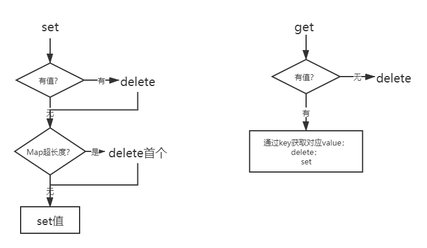

- LRU：最近最久未使用
- FIFO 先进先出置换算法 类似队列
- OPT 最佳置换算法 （理想中存在的）
- NRU Clock置换算法
- LFU 最少使用置换算法
- PBA 页面缓冲算

### LRU:每次访问的数据都会放在栈顶，当访问的数据不在内存中，且栈内数据存储满了，我们就要选择移除栈底的元素，因为在栈底部的数据访问的频率是比较低的。
</img>

```js
/**
 * @param {number} capacity 数量
 */
var LRUCache = function (capacity) {
    this.max = capacity;
    this.res = new Map();
};

/** 
 * @param {number} key
 * @return {number}
 */
LRUCache.prototype.get = function (key) {
    let res = this.res;
    if (res.has(key)) {
        let value = res.get(key)
        res.delete(key)
        res.set(key, value)
        return value;
    } else {
        return -1;
    }
};

/** 
 * @param {number} key 
 * @param {number} value
 * @return {void}
 */
LRUCache.prototype.put = function (key, value) {
    let res = this.res;
    if (res.has(key)) res.delete(key)
    if (res.size === this.max){
        // console.log(res.keys().next().value)
        let key=res.keys()
        let arr=[...key]
        //删除首个
        res.delete(arr[0])
    } 
    // res.delete(res.keys().next().value)
    // 这句代码的意思是res.keys()返回一个迭代器对象，然后next()的意思是返回首个元素的value，然后指针指向下一个值。
    res.set(key, value)
};
```