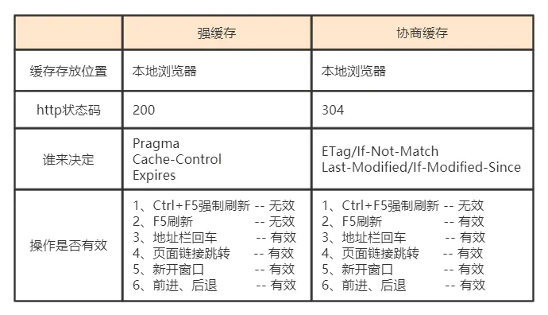
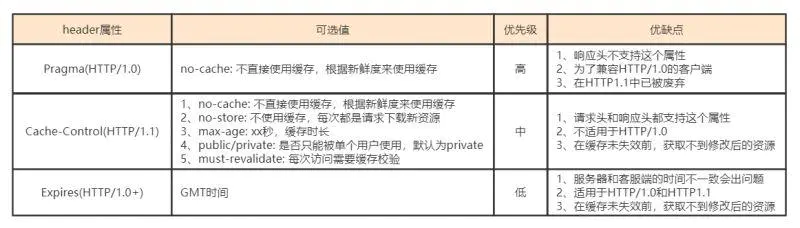
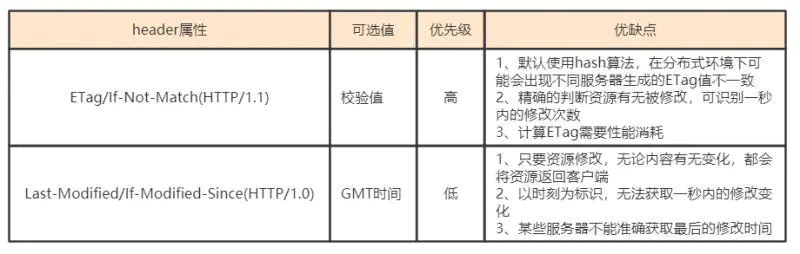

## Web 缓存大致可以分为：数据库缓存、服务器端缓存（代理服务器缓存、CDN 缓存）、浏览器缓存;  
[超详细缓存](https://www.jianshu.com/p/227cee9c8d15)

</img>

### 浏览器缓存分为强缓存和协商缓存，浏览器加载一个页面的简单流程如下：  
> 浏览器先根据这个资源的http头信息来判断是否命中强缓存。（即Cache-Control的max-age没有过期或者Expires的缓存时间没有过期）如果命中则直接加在缓存中的资源，并不会将请求发送到服务器。  

</img>

> 当第一次请求时服务器返回的响应头中没有Cache-Control和Expires或者Cache-Control和Expires过期还或者它的属性设置为no-cache时(即不走强缓存)，那么浏览器第二次请求时就会与服务器进行协商，与服务器端对比判断资源是否进行了修改更新。如果服务器端的资源没有修改，那么就会返回304状态码，告诉浏览器可以使用缓存中的数据，这样就减少了服务器的数据传输压力。如果数据有更新就会返回200状态码，服务器就会返回更新后的资源并且将缓存信息一起返回。跟协商缓存相关的header头属性有（ETag/If-Not-Match 、Last-Modified/If-Modified-Since）请求头和响应头需要成对出现

> 协商缓存的执行流程是这样的：当浏览器第一次向服务器发送请求时，会在响应头中返回协商缓存的头属性：ETag和Last-Modified,其中ETag返回的是一个hash值，Last-Modified返回的是GMT格式的最后修改时间。然后浏览器在第二次发送请求的时候，会在请求头中带上与ETag对应的If-Not-Match，其值就是响应头中返回的ETag的值，Last-Modified对应的If-Modified-Since。服务器在接收到这两个参数后会做比较，如果返回的是304状态码，则说明请求的资源没有修改，浏览器可以直接在缓存中取数据，否则，服务器会直接返回数据。

</img>
