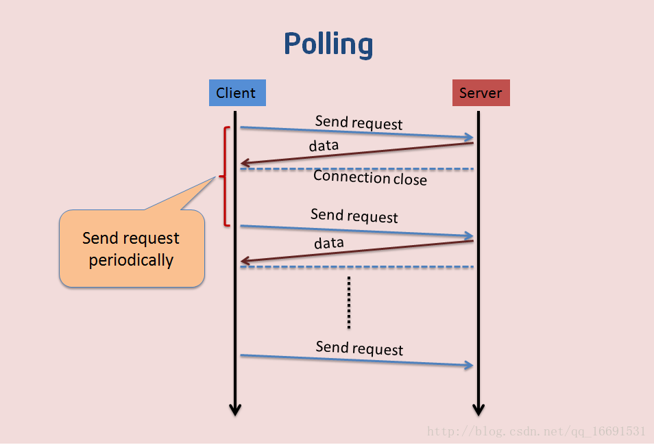

## 什么是websocket?
* websocket是HTML5的协议，支持持久连接。
* http请求不支持持久性连接。
* Http1.0和Http2.0都不支持持久性连接。
* http请求是单向的，客户端发起请求，服务器响应请求，而websocket是建立两者的连接。

---
## 请求过程：
```
GET /chat HTTP/1.1
Host: server.example.com
Upgrade: websocket
Connection: Upgrade
Sec-WebSocket-Key: x3JJHMbDL1EzLkh9GBhXDw==
Sec-WebSocket-Protocol: chat, superchat
Sec-WebSocket-Version: 13
Origin: http://example.com
```
会发现多了两个东西：
```Upgrade: websocket;Connection: Upgrade```   
标识发起的请求就是websocket请求；  

--- 

## websocket的作用？
- 解决ajax轮询（polling:固定时间客户端发起一次请求）
</img>
- 解决long polling：客户端发起一次请求，如果服务端有数据更新就返回该请求结果，如果没有更新则一直把控着这个请求。

---
- polling缺陷：一段时间服务器没有更新，则客户端仍然请求数据，浪费了网络带宽，又浪费了CPU的利用率。
- longpolling缺陷：假设服务器端的数据更新速率较快，更新是速率比传送数据的速率快，那么每次传送的消息都不是及时的。

---

-  webSocket与传统的http有什么优势
>客户端与服务器只需要一个TCP连接，比http长轮询使用更少的连接  
webSocket服务端可以推送数据到客户端  
更轻量的协议头，减少数据传输量  
