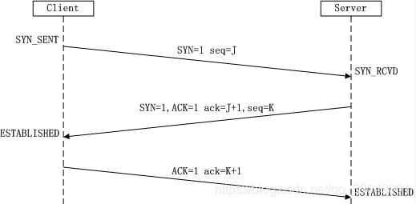

</img>
### SYN发起连接的标志；seq对自己的序列号；ACK回应的标志；
---

- C->B：我想和你发起连接，顺便丢出了SYN=1标志位和seq=J序列号

- B->C：我同意和你连接，我看看你的seq序列号，我就把我的ACK回应参数设置成J+1吧，然后我自己的序列号seq设置成K，SYN=1标志位。

- C->B：我收到你的连接邀请啦，我们开始链接吧。发送给你ACK=K+1;seq=J+1;
---
**注意**
* seq是各自（服务器的seq是服务器的，客户端的seq是客户端的）的一个接受消息的序号排序标志。  
* C->B的seq是J，下一次的C->B的seq是J+1；标志自己发出去的消息的序号。
--- 
### Seq作用
* 保持信息对等；防止脏连接，不会浪费资源。
---
### 为什么一定要三次握手？
* 只有一次：C->S 没回应，无法知道S同不同意连接。
* 只有二次：C->S;S->C;会引发信息对等的一些问题。
   * 比如：C--无效SYN-->S；重发 C--有效的SYN-->S；
   * 这个时候S会收到两个SYN,就会开辟两个内存去连接。
* 三次：完成了前两次握手，第三个握手如果没带着ACK，seq来，那么我们就认为这一次的SYN连接无效，释放资源。从而解决网络延迟。